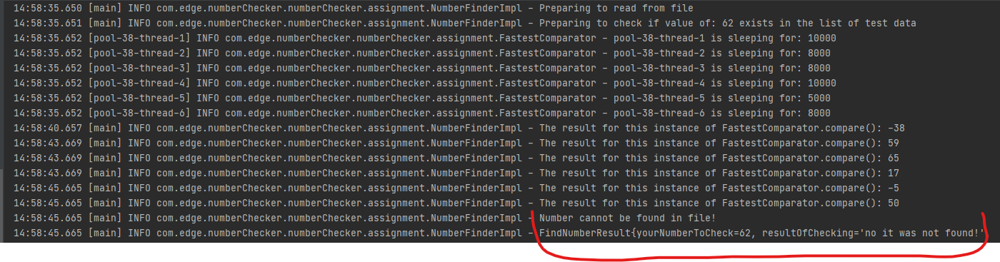

# Edge Technical Challenge

## ---- Updated Instructions on how to use the Application ----
### 1. Just clone the code from this repo. The port of 8088 has been selected to run the Application
### 2. A scanner will prompt you to enter a number so enter any number. Validations are applied to only accept numbers
### 3. Just sit back and let the application return the result. The result is stored in the FindNumberResult return object
### 4. The result is also viewable in the console. i.e. See below snippet for instance
### 5. NumberFinderImplTest.java contains some handy tests. Feel free to take a look at them. They should show the integrity of the App

## Notes on Application Behaviour
* As the requirement specifies me to use the FastestComparator.compare() the obvious hurdle is the Thread.sleep(). To overcome this I have opted to use multiple threads via a ExecutorCompletionService which will poll the various threads and initiate the comparison logic concurrently.
* I have added the pool.shutdown() logic which will terminate any other pending comparison jobs yet to complete. Meaning, the job that first finds the matching value will immediately return said value and the other remaining jobs are terminated. This speeds up the process so that we're not waiting on any pending sleeping threads for instance
* If no matching value is found then all threads are executed. The caveat here is that the thread with the longest "Thread.sleep(mSeconds)" will take just that long. So in the event of no values being found, you could potentially be waiting just over the 10 second mark (assuming that the last thread had a ranomized wait time of 10 seconds) 
* I have tested for thread safety via JUnit5 by using parameterized and repeat test annotations. Have a look in NumberFinderImplTest.java ... Just a note I have a high repeat test value at the moment just to verify the integrity of the logic and it makes more sense to have a lower number in practical terms 
* I also added a logger to the compare() method. This is included to more easily understand the flow of the App. It could be removed afterwards without affecting the one's understanding of the flow

---------------------------
## ---- (Outdated - Ignore!) Instructions on how to run code ----
### 1. Just clone the code from this repo. The port of 8088 has been selected to run the Application against
### 2. The number to check against has been manually inputted in the NumberCheckerApplication.java file. If you want to change the number to check against simply change from 12 to 77 for instance
### 3. Alternatively you can have a look at the UT in place as they test for a variety of different numbers

#### Note: This project requires SpringBoot and Gradle in order to run. Java 8 was used for this exercise
####  As a reference, the original files from the test are located at: src/main/java/com/edge/numberChecker/numberChecker/originalFiles 

